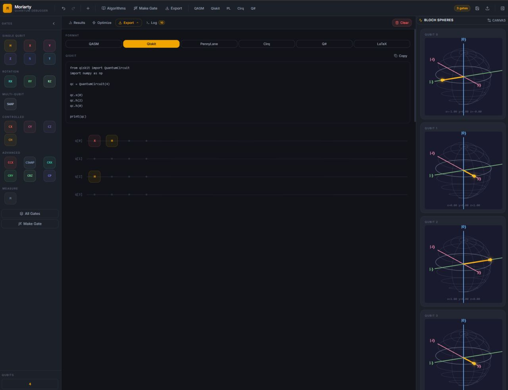
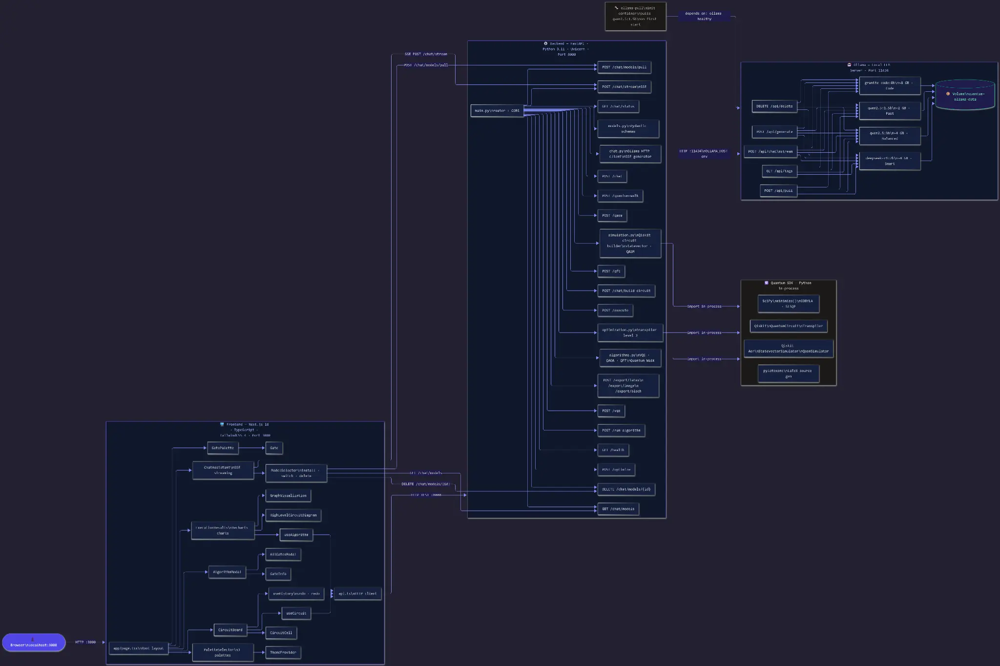

# Moriarty — Depurador de Circuitos Quânticos

**Language / Idioma / Idioma:** [English](./README.md) · [Português (BR)](./README.pt-BR.md) · [Español](./README.es.md)

> Design, simulação e análise de precisão de circuitos quânticos. Uma plataforma web moderna para projetar, simular, otimizar e depurar circuitos quânticos — com um Assistente de IA opcional, algoritmos variacionais (VQE, QAOA) e múltiplas opções de exportação.

[](https://nextjs.org/)
[](https://qiskit.org/)
[-ee9595?style=flat-square)](https://ollama.com/)
[](https://docs.docker.com/compose/)

---

## 🚀 Instalação (Docker - Recomendado)

Docker é o método padrão e recomendado. Ele garante um ambiente consistente e isolado, evitando conflitos de dependência.

**Pré-requisitos:** Docker e Docker Compose precisam estar instalados e em execução. Se ainda não configurou, siga o guia passo a passo para a sua plataforma:

| Plataforma | Guia de Pré-requisitos |
|---|---|
| **Windows** | [docs/install/prerequisites/WINDOWS.md](./docs/install/prerequisites/WINDOWS.md) |
| **Linux** | [docs/install/prerequisites/LINUX.md](./docs/install/prerequisites/LINUX.md) |
| **macOS** | [docs/install/prerequisites/MACOS.md](./docs/install/prerequisites/MACOS.md) |

### Passo 1: Clone o Repositório

```bash
git clone https://github.com/2T0nnks/moriarty.git
cd moriarty
```

### Passo 2: Escolha sua Configuração

#### Opção 1: Padrão (Sem Assistente de IA)

Executa a aplicação principal (construtor de circuitos, simulador, algoritmos) sem as funcionalidades de IA. O botão do Assistente de IA não aparecerá na interface.

```bash
docker-compose up --build
```

#### Opção 2: Com Assistente de IA (CPU)

Adiciona o Assistente de IA, alimentado por um LLM local (Ollama). O modelo será baixado automaticamente na primeira execução (~3 GB).

```bash
docker-compose -f docker-compose.yml -f docker-compose.ai.yml up --build
```

#### Opção 3: Com Assistente de IA (Aceleração por GPU)

Para respostas de IA significativamente mais rápidas, use sua GPU. Isso requer configuração adicional.

1.  **Siga o [Guia de Configuração de GPU](docs/install/gpu/README.md)** para preparar seu sistema.
2.  Use o comando apropriado para o fabricante da sua GPU:
    -   **NVIDIA (CUDA):**
        ```bash
        docker-compose -f docker-compose.yml -f docker-compose.ai.yml -f docker-compose.nvidia.yml up --build
        ```
    -   **AMD (ROCm - Apenas Linux):**
        ```bash
        docker-compose -f docker-compose.yml -f docker-compose.ai.yml -f docker-compose.amd.yml up --build
        ```
    -   **AMD/Intel (Vulkan - Apenas Linux):**
        ```bash
        docker-compose -f docker-compose.yml -f docker-compose.ai.yml -f docker-compose.vulkan.yml up --build
        ```

Após iniciar, a aplicação estará disponível em **[http://localhost:3000](http://localhost:3000)**.

---

## ✨ Funcionalidades

- **Construtor de Circuitos Intuitivo:** Arraste e solte portas lógicas da paleta para o circuito.
- **Esfera de Bloch em Tempo Real:** Visualize instantaneamente o estado de cada qubit enquanto constrói.
- **Simulação de Circuitos:** Execute simulações e veja as probabilidades de estado em um gráfico de barras claro.
- **Assistente de IA:** Obtenha ajuda, faça perguntas e gere circuitos com linguagem natural (requer modo AI).
- **Seleção de Modelos:** Escolha entre uma variedade de modelos de código aberto (Qwen, DeepSeek) para o assistente.
- **Algoritmos Variacionais:** Configure e execute experimentos VQE e QAOA.
- **Otimizador de Circuitos:** Otimize automaticamente seu circuito para melhor desempenho.
- **Múltiplas Opções de Exportação:** Exporte seu circuito para - **Portas Customizadas:** Defina e reutilize suas proprias portas compostas atraves do construtor Make Gate.
QASM, Qiskit, PennyLane, Cirq, Q# e LaTeX.
- **Tema Escuro:** Um tema escuro bonito e confortável para os olhos com detalhes em âmbar.

---

## Screenshot



*Construtor de circuitos com a paleta de portas, esferas de Bloch por qubit e exportacao para Qiskit em tempo real.*

---

## Arquitetura



O Moriarty v2 roda como tres servicos independentes orquestrados por Docker Compose:

| Servico | Stack | Responsabilidade |
|---|---|---|
| **frontend** | Next.js 16 (App Router), TypeScript | Construtor de circuitos drag-and-drop, esferas de Bloch, graficos de probabilidade, configuracao de algoritmos |
| **backend** | FastAPI, Qiskit, Qiskit Aer | Construcao de circuitos a partir de descricoes JSON, simulacao, extracao de statevector, otimizacao, VQE/QAOA, exportacao multi-formato |
| **ollama** *(opcional)* | Ollama | Assistente em linguagem natural executado **localmente** - nenhum dado de circuito sai da maquina |

**Contrato entre camadas.** O frontend nunca manipula objetos Qiskit. Circuitos trafegam como listas ordenadas de descricoes de porta (`{ name, qubits, params }`), e o backend e o unico responsavel por traduzi-las em um `QuantumCircuit`. A logica quantica fica concentrada em um so lugar e o motor de simulacao pode ser trocado sem tocar na interface.

**Portas suportadas.** Um qubit: H, X, Y, Z, S, T, RX, RY, RZ. Dois qubits: CNOT/CX, CY, CZ, CH, SWAP, CRX, CRY, CRZ, CP. Tres qubits: CCX (Toffoli), CSWAP (Fredkin). Medicao: M. Portas compostas podem ser definidas em tempo de execucao via Make Gate.

**Privado por padrao.** O assistente de IA e opcional e roda em container local. Nenhuma chamada para API de terceiros acontece em qualquer caminho de execucao - decisao deliberada para permitir uso em ambientes onde o circuito analisado e sensivel.

---
## 📂 Estrutura do Repositório

```
/moriarty
├── frontend/         # Next.js App Router: layout, páginas, componentes, etc.
├── backend/          # Backend FastAPI + Qiskit
├── docs/             # Documentação e guias de instalação
├── scripts/          # Scripts de conveniência para Linux e Windows
├── docker-compose.yml         # Base: frontend + backend
├── docker-compose.ai.yml      # Override: adiciona Ollama (CPU)
├── docker-compose.nvidia.yml  # Override: GPU NVIDIA
├── docker-compose.amd.yml     # Override: GPU AMD (ROCm)
├── docker-compose.vulkan.yml  # Override: Vulkan (AMD/Intel)
├── .env.example      # Template de variáveis de ambiente
└── README.md         # Este arquivo
```
